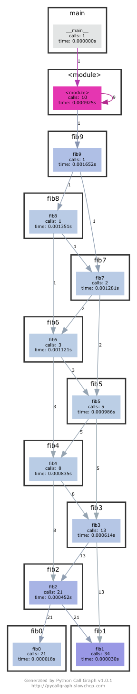
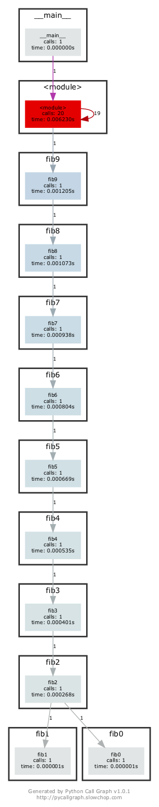
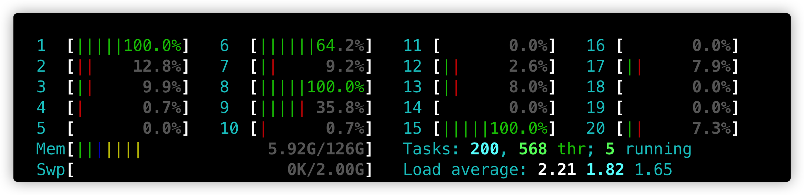
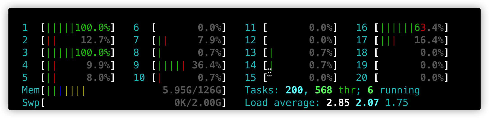

# MIT The Missing Semester of Your CS Education

[](https://github.com/yorkofyou/missing-semester/actions?query=workflow%3ACI)

My solution for [The Missing Semester of Your CS Education](https://missing.csail.mit.edu/) 2020.

## Course overview + the shell

### 2

```shell
cd /tmp
mkdir missing
```

### 3

touch

  Change a file access and modification times (atime, mtime).
  More information: https://www.gnu.org/software/coreutils/touch.

  - Create a new empty file(s) or change the times for existing file(s) to current time:
    touch filename
  - Set the times on a file to a specific date and time:
    touch -t YYYYMMDDHHMM.SS filename
  - Use the times from a file to set the times on a second file:
    touch -r filename filename2

### 4

```shell
cd missing
touch semester
```

### 5

```shell
#!/bin/sh
curl --head --silent https://missing.csail.mit.edu
```

The first line might be tricky to get working. It’s helpful to know that `#` starts a comment in Bash, and `!` has a special meaning even within double-quoted (`"`) strings. Bash treats single-quoted strings (`'`) differently: they will do the trick in this case. See the Bash [quoting](https://www.gnu.org/software/bash/manual/html_node/Quoting.html) manual page for more information.

### 6

```shell
./semester
```

```shell
zsh: permission denied: ./semester
```

```shell
ls -l
```

```shell
total 8
-rw-r--r--  1 yorkyou  staff  61 May 30 22:35 semester
```

No permission to execute the file on my own.

### 7

```shell
sh semester
```

```shell
HTTP/2 200
server: GitHub.com
content-type: text/html; charset=utf-8
last-modified: Fri, 21 May 2021 12:05:33 GMT
access-control-allow-origin: *
etag: "60a7a20d-1f31"
expires: Sun, 30 May 2021 14:55:11 GMT
cache-control: max-age=600
x-proxy-cache: MISS
x-github-request-id: ED24:70A7:D3EC9:F61B6:60B3A4F7
accept-ranges: bytes
date: Sun, 30 May 2021 14:45:11 GMT
via: 1.1 varnish
age: 0
x-served-by: cache-hkg17931-HKG
x-cache: MISS
x-cache-hits: 0
x-timer: S1622385911.318669,VS0,VE252
vary: Accept-Encoding
x-fastly-request-id: 9899eb509df283d29a3bae3dbac4f0279515c186
content-length: 7985
```

> - `./script.sh` makes your shell run the file as if it was a regular executable.
>
>   The shell forks itself and uses a system call (e.g. `execve`) to make the operating system execute the file in the forked process. The operating system will check the file's permissions (hence the execution bit needs to be set) and forward the request to the [program loader](http://en.wikipedia.org/wiki/Loader_(computing)), which looks at the file and determines how to execute it.
>
> - `bash script.sh` makes your shell run `bash` and pass `script.sh` as the command-line argument.
>
>   The operating system will load `bash` (not even looking at `script.sh`, because it's just a command-line argument). The created `bash` process will then interpret the `script.sh` because it's passed as the command-line argument. Because `script.sh` is only read by `bash` as a regular file, the execution bit is not required.

### 9

```shell
chmod u+x semester
./semester
```

```shell
HTTP/2 200
server: GitHub.com
content-type: text/html; charset=utf-8
last-modified: Fri, 21 May 2021 12:05:33 GMT
access-control-allow-origin: *
etag: "60a7a20d-1f31"
expires: Sun, 30 May 2021 14:55:11 GMT
cache-control: max-age=600
x-proxy-cache: MISS
x-github-request-id: ED24:70A7:D3EC9:F61B6:60B3A4F7
accept-ranges: bytes
date: Mon, 31 May 2021 00:47:20 GMT
via: 1.1 varnish
age: 0
x-served-by: cache-hkg17930-HKG
x-cache: HIT
x-cache-hits: 1
x-timer: S1622422040.488156,VS0,VE260
vary: Accept-Encoding
x-fastly-request-id: 3cf83ff73737586b2415dd6438e152ce31f3ba26
content-length: 7985
```

### 10

```shell
./semester | grep last-modified > ~/last-modified.txt
```

## Shell Tools and Scripting

### 1

```shell
ls -ahltG
```

### 2

```shell
#!/bin/zsh

macro() {
	MACRO=$(pwd)
}

polo() {
	cd "$MACRO"
}
```

### 3

```shell
count=1

while true
do
    ./script.sh 2> out.log
    if [[ $? -ne 0 ]]; then
        echo "failed after $count times"
        cat out.log
        break
    fi
    ((count++))

done

```

#### 4

```shell
find . -name '*.html' -print0 | xargs -0 tar -vcf html.zip
```

### 5

```shell
find . -type f -print0 | xargs -0 ls -lt | head -1
```

## Editors (Vim)

### 1

```shell
vimtutor
```

### 6

[Vimium](https://chrome.google.com/webstore/detail/vimium/dbepggeogbaibhgnhhndojpepiihcmeb?hl=en)

[vscodevim](https://marketplace.visualstudio.com/items?itemName=vscodevim.vim)

[IdeaVim](https://plugins.jetbrains.com/plugin/164-ideavim)

[jupyterlab-vim](https://pypi.org/project/jupyterlab-vim/)

zsh

```shell
# Enable vi mode
bindkey -v
```

### 8

1. dd
2. Gdd
3. gg^
4. qwc${<ESC>wv5lc"name": "<ESC>/<<Enter>v6lc,<ESC>wv6lc"email": "<ESC>/<<Enter>v7lc"wc$},<ESC>wq
5. 999@q
6. ggO{
7. Go}

## Data Wrangling

### 2

```shell
grep -E '(a.*){3}[^s]$' /usr/share/dict/words | wc -l
grep -E '(a.*){3}[^s]$' /usr/share/dict/words | sed -E 's/(.*(..))/\2/' | sort | uniq -c | sort -nk1,1 | tail -n3
grep -E '(a.*){3}[^s]$' /usr/share/dict/words | sed -E 's/(.*(..))/\2/' | sort | uniq -c | awk '{print $2}' > occurrence.txt | printf '%s\n' {a..z}{a..z} > all.txt | diff --unchanged-group-format='' <(cat occurrence.txt) <(cat all.txt) | wc -l
```

### 3

```shell
sed -i s/REGEX/SUBSTITUTION/ input.txt > input.txt
```

### 4

```shell
journalctl | grep "Startup finished" | sed -E "s/^.*Startup finished in ([0-9]+\.?[0-9]*)m?s.*$/\1/" | tail -n10 | R --slave -e 'x <- scan(file="stdin", quiet=TRUE); summary(x)'
```

### 5

```shell
for i in 1 2 3; do journalctl -b-$i | grep "Startup finished" ;done | sed -E "s/.*in\ (.*)/\1/" | sort | uniq -c | sort | awk '$1<3 { print }'
```

### 6

```shell
curl -s https://stats.wikimedia.org/EN/TablesWikipediaZZ.htm | pup 'table#table1 json{}' | jq '.[0].children[0].children[12:-3][] | .children[1].text' | sed -E 's/\"([0-9]+)\"/\1/g' | R --slave -e 'x <- scan(file="stdin", quiet=TRUE); summary(x)'
curl -s https://stats.wikimedia.org/EN/TablesWikipediaZZ.htm | pup 'table#table1 json{}' | jq '.[0].children[0].children[12:-3][] | .children[2].text' | sed -E 's/\"([0-9]+)\"/\1/g' | R --slave -e 'x <- scan(file="stdin", quiet=TRUE); summary(x)'
```

## Command-line Environment

**Job Control**

### 1

```shell
sleep 10000
<Ctrl-Z>
bg
pgrep -af sleep
pkill -af sleep
```

### 2

```shell
sleep 60 &
wait %1
ls
```

**Alias**

### 1

```shell
alias dc="cd"
```

**Remote Machines**

### 2

```shell
ssh -L 9999:localhost:8888 my_server
```

### 5

```shell
ssh -fN -L 9999:localhost:8888 my_server
```

## Version Control (Git)

### 2

#### 1

```shell
git log --all --graph --decorate
```

#### 2

```shell
git log -n 1
```

#### 3

```shell
git blame _config.yml | grep collections | sed -E 's/(\w*) .*/\1/g' | xargs git show -s
```

### 4

Stashes are encoded as commit objects, which can be inspected with ```git log```. The ```git stash``` command takes uncommited changes (both staged and unstaged), saves them away for later use, and then reverts them from working copy.

### 5

```shell
[alias]
    graph = log --all --graph --decorate --oneline
```

## Debugging and Profiling

**Debugging**

### 3

```shell
$ shellcheck 3.sh
In 3.sh line 3:
for f in $(ls *.m3u)
         ^---------^ SC2045: Iterating over ls output is fragile. Use globs.
              ^-- SC2035: Use ./*glob* or -- *glob* so names with dashes won't become options.


In 3.sh line 5:
  grep -qi hq.*mp3 $f \
           ^-----^ SC2062: Quote the grep pattern so the shell won't interpret it.
                   ^-- SC2086: Double quote to prevent globbing and word splitting.

Did you mean:
  grep -qi hq.*mp3 "$f" \


In 3.sh line 6:
    && echo -e 'Playlist $f contains a HQ file in mp3 format'
            ^-- SC3037: In POSIX sh, echo flags are undefined.
               ^-- SC2016: Expressions don't expand in single quotes, use double quotes for that.

For more information:
  https://www.shellcheck.net/wiki/SC2045 -- Iterating over ls output is fragi...
  https://www.shellcheck.net/wiki/SC2062 -- Quote the grep pattern so the she...
  https://www.shellcheck.net/wiki/SC3037 -- In POSIX sh, echo flags are undef...
```

```shell
#!/bin/sh
## Example: a typical script with several problems
for f in ./*.m3u
do
  grep -qi "hq.*mp3" "$f" \
    && echo "Playlist $f contains a HQ file in mp3 format"
done
```

**Profiling**

### 1

```shell
python -m cProfile sorts.py | grep sorts.py
```

```shell
        1    0.000    0.000    0.125    0.125 sorts.py:1(<module>)
     1000    0.017    0.000    0.017    0.000 sorts.py:11(insertionsort)
33912/1000    0.016    0.000    0.024    0.000 sorts.py:23(quicksort)
    16456    0.004    0.000    0.004    0.000 sorts.py:27(<listcomp>)
    16456    0.004    0.000    0.004    0.000 sorts.py:28(<listcomp>)
33886/1000    0.017    0.000    0.018    0.000 sorts.py:32(quicksort_inplace)
        3    0.002    0.001    0.121    0.040 sorts.py:4(test_sorted)
     3000    0.008    0.000    0.057    0.000 sorts.py:6(<listcomp>)
```

Decorate `quicksort`, `quicksort_inplace`, `insertionsort` with `@profile`, then run:

```shell
kernprof -l -v sorts.py
```

```shell
Total time: 0.058093 s
File: sorts.py
Function: quicksort at line 24

Line #      Hits         Time  Per Hit   % Time  Line Contents
==============================================================
    24                                           @profile
    25                                           def quicksort(array):
    26     34020       9417.0      0.3     16.2      if len(array) <= 1:
    27     17510       4084.0      0.2      7.0          return array
    28     16510       4236.0      0.3      7.3      pivot = array[0]
    29     16510      15763.0      1.0     27.1      left = [i for i in array[1:] if i < pivot]
    30     16510      15607.0      0.9     26.9      right = [i for i in array[1:] if i >= pivot]
    31     16510       8986.0      0.5     15.5      return quicksort(left) + [pivot] + quicksort(right)
```

```shell
Total time: 0.13372 s
File: sorts.py
Function: insertionsort at line 11

Line #      Hits         Time  Per Hit   % Time  Line Contents
==============================================================
    11                                           @profile
    12                                           def insertionsort(array):
    13                                           
    14     25797       3998.0      0.2      3.0      for i in range(len(array)):
    15     24797       4050.0      0.2      3.0          j = i-1
    16     24797       4252.0      0.2      3.2          v = array[i]
    17    226646      43663.0      0.2     32.7          while j >= 0 and v < array[j]:
    18    201849      39002.0      0.2     29.2              array[j+1] = array[j]
    19    201849      33832.0      0.2     25.3              j -= 1
    20     24797       4772.0      0.2      3.6          array[j+1] = v
    21      1000        151.0      0.2      0.1      return array
```

```shell
Total time: 0.120478 s
File: sorts.py
Function: quicksort_inplace at line 34

Line #      Hits         Time  Per Hit   % Time  Line Contents
==============================================================
    34                                           @profile
    35                                           def quicksort_inplace(array, low=0, high=None):
    36     34050       7115.0      0.2      5.9      if len(array) <= 1:
    37        38          3.0      0.1      0.0          return array
    38     34012       6265.0      0.2      5.2      if high is None:
    39       962        214.0      0.2      0.2          high = len(array)-1
    40     34012       6211.0      0.2      5.2      if low >= high:
    41     17487       2740.0      0.2      2.3          return array
    42                                           
    43     16525       3123.0      0.2      2.6      pivot = array[high]
    44     16525       3112.0      0.2      2.6      j = low-1
    45    126331      23693.0      0.2     19.7      for i in range(low, high):
    46    109806      20277.0      0.2     16.8          if array[i] <= pivot:
    47     57399      10540.0      0.2      8.7              j += 1
    48     57399      13824.0      0.2     11.5              array[i], array[j] = array[j], array[i]
    49     16525       4503.0      0.3      3.7      array[high], array[j+1] = array[j+1], array[high]
    50     16525       8123.0      0.5      6.7      quicksort_inplace(array, low, j)
    51     16525       7849.0      0.5      6.5      quicksort_inplace(array, j+2, high)
    52     16525       2886.0      0.2      2.4      return array
```

```shell
python -m memory_profiler sorts.py
```

```shell
Filename: sorts.py

Line #    Mem usage    Increment  Occurences   Line Contents
============================================================
    24   42.828 MiB   42.828 MiB       34018   @profile
    25                                         def quicksort(array):
    26   42.828 MiB    0.000 MiB       34018       if len(array) <= 1:
    27   42.828 MiB    0.000 MiB       17509           return array
    28   42.828 MiB    0.000 MiB       16509       pivot = array[0]
    29   42.828 MiB    0.000 MiB      158788       left = [i for i in array[1:] if i < pivot]
    30   42.828 MiB    0.000 MiB      158788       right = [i for i in array[1:] if i >= pivot]
    31   42.828 MiB    0.000 MiB       16509       return quicksort(left) + [pivot] + quicksort(right)
```

```shell
Filename: sorts.py

Line #    Mem usage    Increment  Occurences   Line Contents
============================================================
    34   42.844 MiB   42.828 MiB       32818   @profile
    35                                         def quicksort_inplace(array, low=0, high=None):
    36   42.844 MiB    0.000 MiB       32818       if len(array) <= 1:
    37   42.844 MiB    0.000 MiB          48           return array
    38   42.844 MiB    0.000 MiB       32770       if high is None:
    39   42.844 MiB    0.000 MiB         952           high = len(array)-1
    40   42.844 MiB    0.000 MiB       32770       if low >= high:
    41   42.844 MiB    0.000 MiB       16861           return array
    42                                         
    43   42.844 MiB    0.000 MiB       15909       pivot = array[high]
    44   42.844 MiB    0.000 MiB       15909       j = low-1
    45   42.844 MiB    0.016 MiB      120321       for i in range(low, high):
    46   42.844 MiB    0.000 MiB      104412           if array[i] <= pivot:
    47   42.844 MiB    0.000 MiB       53912               j += 1
    48   42.844 MiB    0.000 MiB       53912               array[i], array[j] = array[j], array[i]
    49   42.844 MiB    0.000 MiB       15909       array[high], array[j+1] = array[j+1], array[high]
    50   42.844 MiB    0.000 MiB       15909       quicksort_inplace(array, low, j)
    51   42.844 MiB    0.000 MiB       15909       quicksort_inplace(array, j+2, high)
    52   42.844 MiB    0.000 MiB       15909       return array
```

```shell
Filename: sorts.py

Line #    Mem usage    Increment  Occurences   Line Contents
============================================================
    11   42.969 MiB   42.844 MiB        1000   @profile
    12                                         def insertionsort(array):
    13                                         
    14   42.969 MiB    0.000 MiB       26183       for i in range(len(array)):
    15   42.969 MiB    0.000 MiB       25183           j = i-1
    16   42.969 MiB    0.000 MiB       25183           v = array[i]
    17   42.969 MiB    0.031 MiB      231723           while j >= 0 and v < array[j]:
    18   42.969 MiB    0.062 MiB      206540               array[j+1] = array[j]
    19   42.969 MiB    0.031 MiB      206540               j -= 1
    20   42.969 MiB    0.000 MiB       25183           array[j+1] = v
    21   42.969 MiB    0.000 MiB        1000       return array
```

### 6





### 8





## Metaprogramming

### 1

```makefile
paper.pdf: paper.tex plot-data.png
	pdflatex paper.tex

plot-%.png: %.dat plot.py
	./plot.py -i $*.dat -o $@

.PHONY: clean
clean:
	git ls-files --others | xargs rm -f
```

## Security and Cryptography

### 1

#### 1

~66.44 bits

#### 2

~47.63 bits

#### 3

`correcthorsebatterystaple`

#### 4

3.17e+8 years for `correcthorsebatterystaple` and 692 years for `rg8Ql34g`
